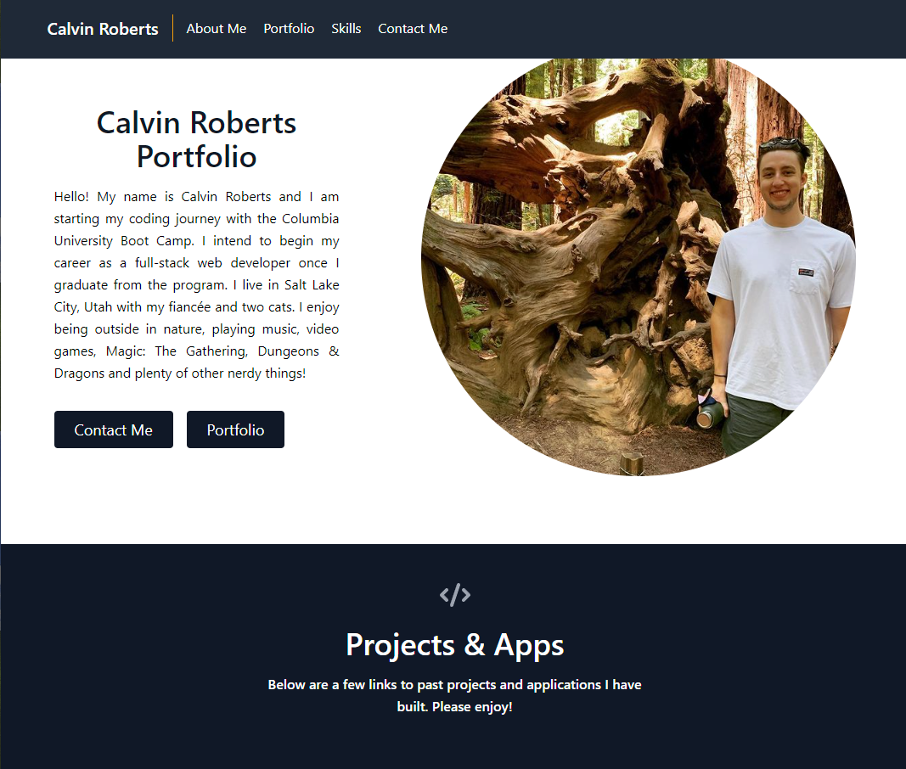

# React Portfolio

## Description

This project serves as a portfolio of all my coding projects. This portfolio is created with React.

## Table of Contents

- [Installation](#installation)
- [Screenshot](#screenshot)
- [Credits](#credits)
- [License](#license)

## Installation

- `Node.js`
- `npm install --global yarn`
- `npm install -D tailwindcss`
  - `npx tailwindcss init`

## Screenshot

## Credits

- Columbia Coding Bootcamp
- Reed Barger's React walkthrough https://www.freecodecamp.org/news/build-portfolio-website-react/

## License

MIT License  (https://opensource.org/licenses/MIT)
